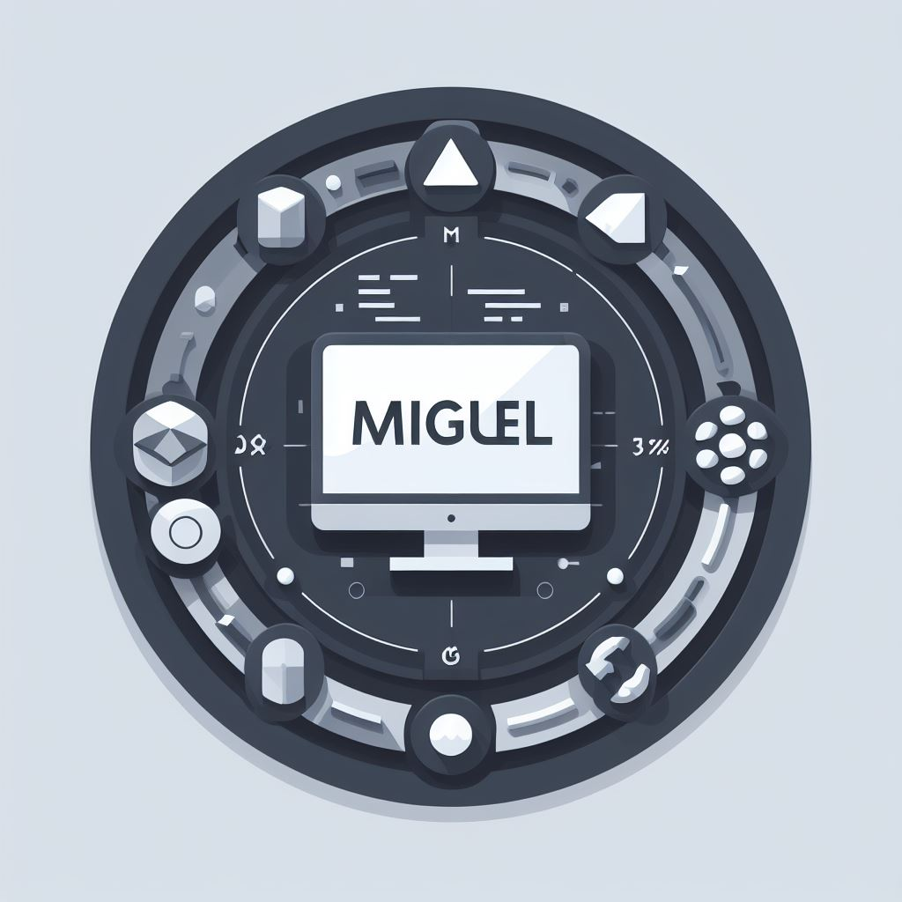

<h2>Hey there! I'm Miguel </h2>

<!-- ## 👋 &nbsp;Hey there! I'm Aditya -->

### 👨🏻‍💻 &nbsp;About Me

💡 &nbsp;I like to explore new technologies and develop software solutions and quick hacks.\
🎓 &nbsp;I'm currently studying Systems engineering at the University Uniciencia.\
🌱 &nbsp;I'm on track for learning more about Artificial Intelligence, Systems Design, and Cloud Architecture.\
✍️ &nbsp;In my free time I dedicate myself to learning about Docker and improving my coding skills.\
💬 &nbsp;Feel free to reach out to me for pro bono consulting and volunteering, or just for some interesting discussion.\
✉️ &nbsp;You can shoot me an email at ninosilvagpt@gmail.com ! I'll try to respond as soon as I can.\
📄 &nbsp;Please have a look at my [Résumé](https://campuslands-my.sharepoint.com/personal/andres_lizarazo_campuslands_com/_layouts/15/onedrive.aspx?id=%2Fpersonal%2Fandres%5Flizarazo%5Fcampuslands%5Fcom%2FDocuments%2F%F0%9F%9A%80%20Campus%20Lands%2FDirecci%C3%B3n%20General%20Campus%2FInformaci%C3%B3n%20Campers%2FBancolombia%2FMiguel%20Angel%20Ni%C3%B1o%20Silva%2Epdf&parent=%2Fpersonal%2Fandres%5Flizarazo%5Fcampuslands%5Fcom%2FDocuments%2F%F0%9F%9A%80%20Campus%20Lands%2FDirecci%C3%B3n%20General%20Campus%2FInformaci%C3%B3n%20Campers%2FBancolombia&ga=1l) for more details about me. I'm open to feedback and suggestions!

### 🛠 &nbsp;Tech Stack

&nbsp;
&nbsp;
&nbsp;
&nbsp;
&nbsp;
\
&nbsp;
&nbsp;
&nbsp;
&nbsp;\
&nbsp;
&nbsp;

### ⚙️ &nbsp;GitHub Analytics

### 🤝🏻 &nbsp;Connect with Me

-----
Credits: [Aditya Vikram Singh](https://github.com/AVS1508)

Last Edited on: 11/12/2020